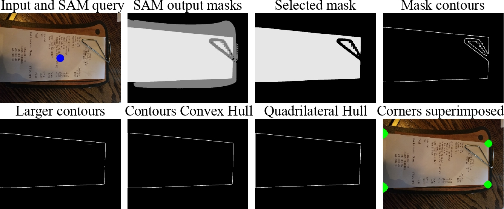
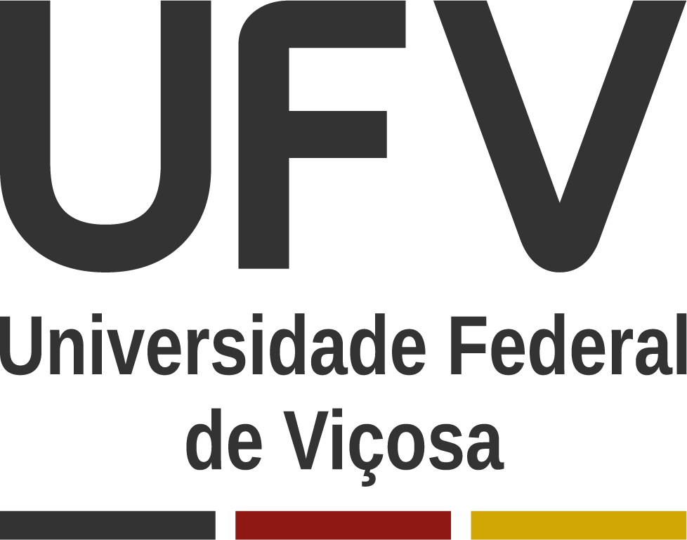

# A Filtering and Image Preparation Approach to Enhance OCR for Fiscal Receipts

This repository contains the code for the image pipeline of the paper A Filtering and Image Preparation Approach to Enhance OCR for Fiscal Receipts presented at 37th SIBGRAPI Conference on Graphics, Patterns and Images (SIBGRAPI), 2024.



We propose a pipeline divided into two main steps:

1. A filtering approach based on low-level features to identify and discard poor-quality images, select high-quality ones, and flag images that need preparation before OCR; 
2. The flagged images undergo a series of enhancement techniques, including homography transformation, super-resolution, noise reduction, sharpness adjustment, character standardization, and binarization.

If you find this work useful for your research, please cite our paper:

```bibtex
@inproceedings{Auad2024,
    title = {A filtering and image preparation approach to enhance OCR for fiscal receipts},
    author = {Auad, Manoela W and Alves, Sarah C and Kakizaki, Gabriel S and Reis, Julio C. S. and Silva, Michel M},
    year = {2024},
    booktitle = {Proceedings of the 37th Conference on Graphics, Patterns and Images (SIBGRAPI)},
    keywords = {optical character recognition, image filtering, image enhancement, fiscal receipts},
    url = {http://urlib.net/ibi/8JMKD3MGPEW34M/4C22QAL}
}
```
## Instructions

### Prerequisites

**Heads-up:** This project requires a GPU to run properly.

1. **Python 3.7**: Make sure you have Python 3.7 installed.
2. **Tesseract OCR**: Install Tesseract OCR. You can find the installation instructions [here](https://github.com/tesseract-ocr/tesseract).
3. **Segment Anythin Model Checkpoint**: Download the Model Checkpoint default or vit_h from SAM [here](https://github.com/facebookresearch/segment-anything). Save the downloaded file in the root folder of sibgrapi24-main.

### Setup

1. **Create and activate the virtual environment**:
- Create a virtual environment called `filtering-preparation-ocr` with Python 3.7 using the command below:
    ```bash
    python3.7 -m venv filtering-preparation-ocr
    ```
- Activate the virtual environment:
    - **Linux/macOS**:
    ```bash
    source filtering-preparation-ocr/bin/activate
    ```
    
    - **Windows**:
    ```bash
    filtering-preparation-ocr\Scripts\activate
    ```

2. **Install dependencies**:
- Navigate to the `src` folder:
    ```bash
    cd src
    ```
- Install the dependencies listed in the `requirements.txt` file:
    ```bash
    pip install -r requirements.txt
    ```

### Execution

- Go back to root folder:
    ```bash
    cd ..
    ```
- Run the Kedro pipeline:
    ```bash
    kedro run
    ```

By following these steps, the environment will be configured and the project can be executed.

## Contact

### Authors

* [Manoela Auad](https://github.com/ManoelaWerneck) - BSc. student - UFV - manoela.auad@ufv.br
* Sarah Alves - BSc. student - UFV - sarah.c.alves@ufv.br
* Gabriel Kakizaki - BSc. student - UFV -  gabriel.kakizaki@ufv.br
* Julio Reis - Professor at Universidade Federal de Viçosa (UFV) - jreis@ufv.br
* [Michel Silva](https://michelmelosilva.github.io/) - Professor at Universidade Federal de Viçosa (UFV) - michel.m.silva@ufv.br

### Institution

Universidade Federal de Viçosa (UFV)
Departamento de Informática
Viçosa, Minas Gerais, Brazil 

### Laboratory

| [](https://mavilab-ufv.github.io/) | [](https://www.ufv.br/) |
| --------------------------------------------------------------------------------------------------------------------------------------------------------------------------- | ------------------------------------------------------------------- |

**MaVILab**: Machine Vision and Intelligence Laboratory \
 <https://mavilab-ufv.github.io>

## Acknowledgements

We would like to thank CAPES, FAPEMIG, and CNPq for supporting this project.